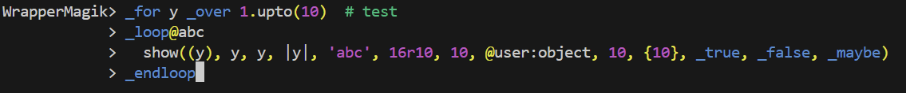
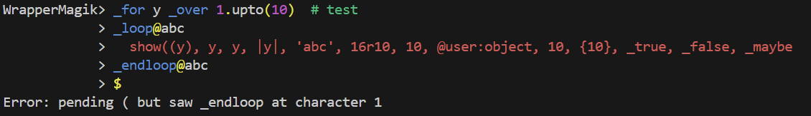

# Magik session wrapper

A wrapper around `runalias` which provides a better prompt than the standard Magik prompt.

The standard Magik/CLI prompt is a bit bare bones. On Windows there is a bit of additional functionality such as previous/next command, but on Linux the prompt is minimal. As a result, the prompt is barely usable. This wrapper provides a better experience by providing functionality which is standard in regular REPL prompts.

## Usage

Run the wrapper with the command as you would normally run the `runalias`/`runalias.exe` command as arguments after a `--`. For example:

```shell
$ java -jar magik-session-wrapper-<version>.jar --debug --do-not-wait-for-prompt -- /opt/Smallworld/core/bin/share/runalias -j -Djava.awt.headless=true base
Sourcing .../core/config/environment


---- Magik version 5.3.0.0-490 ----
---- Running on Java version 17.0.13 ----

Starting
...
```

When the session is started AND a Magik prompt is provided (i.e., you would see `Magik>`), the wrapper will show its own prompt:

```text
Found smallworld_registry: .../smallworld_registry (using environment variable SMALLWORLD_GIS)
WrapperMagik>
```

Then, you can use it like your normal Magik prompt, with added functionality. For example, syntax highlighting:



Or in case of a syntax error, due to a missing `)` at the `show` invocation:


In case you need to force transmit the prompt to the session, write a single `$`-symbol on the last line:



## Supported functionality

* Parsing of Magik
* Syntax error detection/detection of incomplete statements
* Completion of:
  * Electric Magik templates
  * Magik keywords
* Highlighting
* History
* Navigation using the keyboard:
  * Left/right/up/down arrow keys to move within prompt
  * Up/down to recall history
  * Regular Unix keys:
    * Ctrl-a to move cursor to start of line
    * Ctrl-b to move cursor back one character
    * Ctrl-f to move cursor forward one character
    * Ctrl-r to search history
    * Ctrl-u to cut the current line
    * Ctrl-y to paste/"yank"
    * Ctrl-_ to undo action
    * Ctrl-backspace to delete word
    * Alt-enter to insert line
    * ...
  * ANSI colors, for example through [sw5_color_terminal](https://github.com/StevenLooman/sw5_color_terminal)
